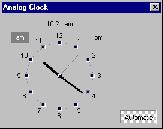



## Analog Clock with mouse control

### Description

Analog Clock control where you can use your mouse to rotate the hours and minutes. Ideal to obtain time the graphical way from the user. Can also be used as a simple running time display. Left-Click and drag the minutes, Right-Click and drag the hours. Colours, fonts and some other attributes can be changed (look and see). This is just a usercontrol (ctl+ctx) file to include with your project, if you really want to, make your own ocx from it.
 
### More Info
 
Just the time (optional).

How to insert a usercontrol file into a project.

The time ofcause.

None know. But you can see users smiling, when they see it.

             |
---                |---
**Submitted On**   |1999-12-29 09:39:34
**By**             |[Tony](https://github.com/Planet-Source-Code/PSCIndex/blob/master/ByAuthor/tony.md)
**Level**          |Intermediate
**User Rating**    |4.9 (49 globes from 10 users)
**Compatibility**  |VB 4\.0 \(32\-bit\), VB 5\.0, VB 6\.0
**Category**       |[Custom Controls/ Forms/  Menus](https://github.com/Planet-Source-Code/PSCIndex/blob/master/ByCategory/custom-controls-forms-menus__1-4.md)
**World**          |[Visual Basic](https://github.com/Planet-Source-Code/PSCIndex/blob/master/ByWorld/visual-basic.md)
**Archive File**   |[CODE\_UPLOAD260412291999\.zip](https://github.com/Planet-Source-Code/tony-analog-clock-with-mouse-control__1-5175/archive/master.zip)

### API Declarations

None used this time.

